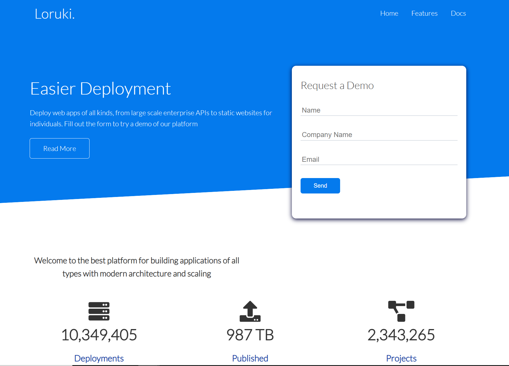
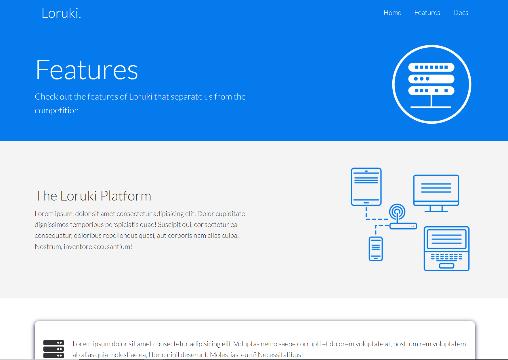

# Loruki

> Loruki | Cheap cloud Hosting platform For Everyone. -

## Table of contents

- [Loruki](#loruki)
  - [Table of contents](#table-of-contents)
  - [General info](#general-info)
  - [Screenshots](#screenshots)
  - [Technologies](#technologies)
  - [Setup](#setup)
  - [Code Examples](#code-examples)
  - [Features](#features)
  - [Status](#status)
  - [Inspiration](#inspiration)
  - [Contact](#contact)
  - [Instructions for use](#instructions-for-use)
  - [Code Quality Checks](#code-quality-checks)
  - [Continuous Integration (CI)](#continuous-integration-ci)
  - [Repo Setup](#repo-setup)

## General info

> Loruki offers affordable cloud hosting with reliable performance, easy
> scalability, and developer-friendly features.

## Screenshots





## Technologies

- NPM 10.9.2
- VSC code
- HTML
- CSS

## Setup

- clone the repository
- `npm install`

## Code Examples

```HTML
<section class="stats">
      <div class="container">
        <h3 class="stats-heading text-center my-1">
          Welcome to the best platform for building applications of all types
          with modern architecture and scaling
        </h3>

        <div class="grid grid-3 text-center my-4">
          <div>
            <i class="fas fa-server fa-3x"></i>
            <h3>10,349,405</h3>
            <p class="text-secondary">Deployments</p>
          </div>
          <div>
            <i class="fas fa-upload fa-3x"></i>
            <h3>987 TB</h3>
            <p class="text-secondary">Published</p>
          </div>
          <div>
            <i class="fas fa-project-diagram fa-3x"></i>
            <h3>2,343,265</h3>
            <p class="text-secondary">Projects</p>
          </div>
        </div>
      </div>
    </section>
```

```CSS
@keyframes slideInFromLeft {
  0% {
    transform: translateX(-100%);
  }

  100% {
    transform: translateX(0);
  }
}

@keyframes slideInFromRight {
  0% {
    transform: translateX(100%);
  }

  100% {
    transform: translateX(0);
  }
}

@keyframes slideInFromTop {
  0% {
    transform: translateY(-100%);
  }

  100% {
    transform: translateX(0);
  }
}

@keyframes slideInFromBottom {
  0% {
    transform: translateY(100%);
  }

  100% {
    transform: translateX(0);
  }
}
```

## Features

List of features ready and Todos for future development

- [x] navigation bar
- [x] home page showcase with animation
- [x] main content for home, features and docs pages
- [x] resource links for information
- [x] footer socail links

To-do list:

- [ ] dark and white theme for the site

## Status

Project is: _done_

## Inspiration

Project by freeCodeCamp.org

## Contact

By

- [Sajid Hussain](https://github.com/SajidHussainabbasi)
- [Daniiel Mykytiuk](https://github.com/danmkt00)
- [Harley Clair](https://github.com/harley-dane)
- [Catherine Lin](https://github.com/boba-milktea)

## Instructions for use

<details>
  <summary>Getting Started</summary>

<!-- a guide to using this repository -->

1. `git clone git@github.com:HackYourFutureBelgium/template-markdown.git`
2. `cd template-markdown`
3. `npm install`

## Code Quality Checks

- `npm run format`: Makes sure all the code in this repository is well-formatted
  (looks good).
- `npm run lint:ls`: Checks to make sure all folder and file names match the
  repository conventions.
- `npm run lint:md`: Will lint all of the Markdown files in this repository.
- `npm run lint:css`: Will lint all of the CSS files in this repository.
- `npm run validate:html`: Validates all HTML files in your project.
- `npm run spell-check`: Goes through all the files in this repository looking
  for words it doesn't recognize. Just because it says something is a mistake
  doesn't mean it is! It doesn't know every word in the world. You can add new
  correct words to the [./.cspell.json](./.cspell.json) file so they won't cause
  an error.
- `npm run accessibility -- ./path/to/file.html`: Runs an accessibility analysis
  on all HTML files in the given path and writes the report to
  `/accessibility_report`

## Continuous Integration (CI)

When you open a PR to `main`/`master` in your repository, GitHub will
automatically do a linting check on the code in this repository, you can see
this in the[./.github/workflows/lint.yml](./.github/workflows/lint.yml) file.

If the linting fails, you will not be able to merge the PR. You can double check
that your code will pass before pushing by running the code quality scripts
locally.

## Repo Setup

- Give each member **_write_** access to the repo (if it's a group project)
- Turn on GitHub Pages and put a link to your website in the repo's description
- Go to _General_ Section > check **Discussions**
- In the _Branches_ section of your repo's settings make sure the
  `master`/`main` branch must:
  - "_Require a pull request before merging_"
  - "_Require approvals_"
  - "_Dismiss stale pull request approvals when new commits are pushed_"
  - "_Require status checks to pass before merging_"
  - "_Require branches to be up to date before merging_"
  - "_Do not allow bypassing the above settings_"

</details>
